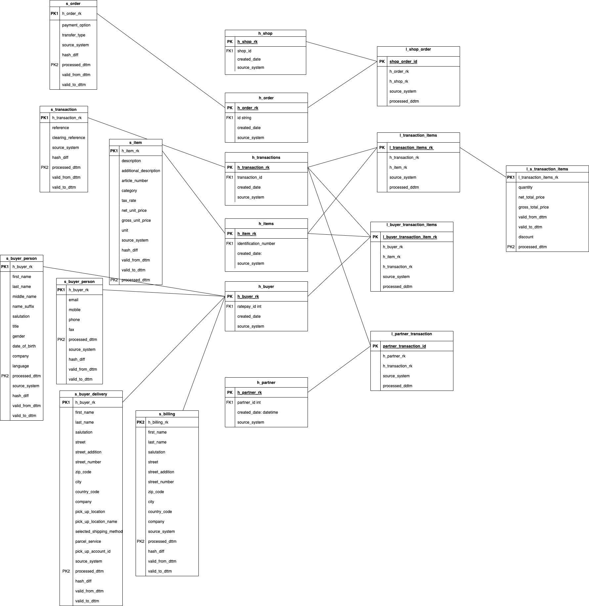

# Task

* Design an entity relationship model to store event data using the data vault methodology. Not all attributes necessarily need to be a part of the model.
* Implement a DDL script to deploy the designed model into a relational database system.
* Provide a SQL query to:
   - read the latest version of all basket items for a specific transaction_id (e.g. PAXTT41Y9J7N6JLGZV6V) based on your data model
   - read the value of the delivery address at a certain point in time for a specific ratepay_id
* Prepare a presentation of the data model to explain the challenges and your design decisions.

# Data Event Sample
```
{
  "id": "c833e30f-6ed8-4404-8947-876efd5780c6",
  "created": "2021-12-09T12:10:00.469615+01:00",
  "category": "DATA",
  "origin": {
    "domain": "services-staging.nexinto.ratepay.com",
    "subDomain": "omara",
    "host": "my-host-api-s01",
    "key": null,
    "version": "10.38.0"
  },
  "payload": {
    "type": "ORDER_REQUESTED",
    "gateway_request_id": "8bed019e-eca5-499c-a4a1-bbc4ce645058",
    "order": {
      "id": "PAXTT41Y9J7N6JLGZV6V",
      "created": "2021-12-09T12:09:59.949+01:00",
      "shop_order_id": "shop-transaction-id-1234",
      "shop_buyer_id": null,
      "shop_reference_id": null,
      "marketplace_id": null,
      "shipping_details": null,
      "basket": {
        "shop_items": [
          {
            "shop_details": {
              "id": "0c6f90ab4a0b24ef525da47e283559",
              "shop_transaction_id": "shop-transaction-id-1234"
            },
            "items": {
              "processed": [
                {
                  "description": "fruit knife",
                  "additional_description": "fruit knife with curved blade, 8 cm",
                  "article_number": "kitchen-utils-1",
                  "category": "household",
                  "quantity": 2,
                  "unit": "piece",
                  "tax_rate": 19,
                  "net_unit_price": 15.5,
                  "gross_unit_price": 18.45,
                  "net_unit_discount": -1.3,
                  "gross_unit_discount": -1.55,
                  "net_total_price": 28.4,
                  "gross_total_price": 33.8,
                  "id": null,
                  "item_id": null,
                  "identification_number": "kitchen-utils-1",
                  "unique_identification_number": null,
                  "unit_price_gross": 18.45,
                  "discount": -1.55
                }
              ],
              "open": [],
              "cancelled": [],
              "shipped": [],
              "returned": []
            },
            "gross_amount": 33.8,
            "vats": [
              {
                "net_amount": 28.4,
                "tax_amount": 5.4,
                "tax_rate": 19
              }
            ]
          }
        ],
        "items": [
          {
            "description": "fruit knife",
            "additional_description": "fruit knife with curved blade, 8 cm",
            "article_number": "kitchen-utils-1",
            "category": "household",
            "quantity": 2,
            "unit": "piece",
            "tax_rate": 19,
            "net_unit_price": 15.5,
            "gross_unit_price": 18.45,
            "net_unit_discount": -1.3,
            "gross_unit_discount": -1.55,
            "net_total_price": 28.4,
            "gross_total_price": 33.8,
            "id": null,
            "item_id": null,
            "identification_number": "kitchen-utils-1",
            "unique_identification_number": null,
            "unit_price_gross": 18.45,
            "discount": -1.55
          }
        ],
        "special_items": [
          {
            "description": "fruit knife",
            "additional_description": "fruit knife with curved blade, 8 cm",
            "article_number": "kitchen-utils-1",
            "category": "household",
            "quantity": 2,
            "unit": "piece",
            "tax_rate": 19,
            "net_unit_price": 15.5,
            "gross_unit_price": 18.45,
            "net_unit_discount": -1.3,
            "gross_unit_discount": -1.55,
            "net_total_price": 28.4,
            "gross_total_price": 33.8,
            "type": null,
            "price_gross": 33.8
          }
        ],
        "amount": 33.8,
        "currency": "EUR",
        "basket_special_items": {
          "processed": [
            {
              "description": "fruit knife",
              "additional_description": "fruit knife with curved blade, 8 cm",
              "article_number": "kitchen-utils-1",
              "category": "household",
              "quantity": 2,
              "unit": "piece",
              "tax_rate": 19,
              "net_unit_price": 15.5,
              "gross_unit_price": 18.45,
              "net_unit_discount": -1.3,
              "gross_unit_discount": -1.55,
              "net_total_price": 28.4,
              "gross_total_price": 33.8,
              "type": null,
              "price_gross": 33.8
            }
          ],
          "open": [],
          "cancelled": [],
          "shipped": [],
          "returned": []
        }
      },
      "transaction_id": "PAXTT41Y9J7N6JLGZV6V",
      "reference": "BB0025728M0",
      "clearing_reference": "328918",
      "merchant_order_id": "shop-transaction-id-1234",
      "partner_transaction_id": "partner-transaction-id-1234",
      "shop_id": 97000001,
      "partner_id": 97000001,
      "buyer": {
        "ratepay_id": 20050925,
        "person": {
          "first_name": "Heinz",
          "last_name": "Steeger",
          "middle_name": null,
          "name_suffix": null,
          "salutation": null,
          "title": "Dr.",
          "gender": null,
          "date_of_birth": "1971-05-19"
        },
        "company": null,
        "contact": {
          "email": "max.musterman@example.org",
          "mobile": null,
          "phone": "+49 177 000000000",
          "fax": null
        },
        "delivery_address": {
          "first_name": "Max",
          "last_name": "musterman",
          "salutation": null,
          "company": "Berlin Advertising Agency",
          "normalized": {
            "street": "Some Street",
            "street_addition": "Side Entry, 2nd floor",
            "street_number": "84",
            "zip_code": "10439",
            "city": "Berlin",
            "country_code": "DE"
          },
          "original": {
            "street": "Some Street",
            "street_addition": "Side Entry, 2nd floor",
            "street_number": "84",
            "zip_code": "10439",
            "city": "Berlin",
            "country_code": "DE"
          },
          "pick_up_location": false,
          "pick_up_location_name": null,
          "selected_shipping_method": null,
          "parcel_service": null,
          "pick_up_account_id": null
        },
        "billing_address": {
          "first_name": "Max",
          "last_name": "Musterman",
          "salutation": null,
          "company": null,
          "normalized": {
            "street": "Some Street",
            "street_addition": "Side Entry, 2nd floor",
            "street_number": "84",
            "zip_code": "10439",
            "city": "Berlin",
            "country_code": "DE"
          },
          "original": {
            "street": "Some Street",
            "street_addition": "Side Entry, 2nd floor",
            "street_number": "84",
            "zip_code": "10439",
            "city": "Berlin",
            "country_code": "DE"
          }
        },
        "bank_details": null,
        "language": "de",
        "known_internal": true,
        "known_external": false,
        "known_merchant_buyer": false
      },
      "device": null,
      "payment_method": {
        "payment_option": "INVOICE",
        "transfer_type": "BANK_TRANSFER"
      },
      "installment_details": null
    },
    "version": "21.16.5",
    "minimum_settings_instant": 1639048199949
  }
```

# ER Model




# Design Summary

For designing Hubs, provided sample of event data were analyzed and identified the main business entities. Since the whole business process was not fully known to me, those entities were selected that could be distinguished based on the data provided.

## Hubs

Recognized business keys and service fields ```source_system``` and ```processed_dttm``` were added to Hubs to indicate the system of the data source and the time the hub was loaded into the system.  
```processed_dttm``` populated via the staging schema or extract, transform, and load ETL code, and ```source_system``` is populated via the staging schema or ETL code.  
In this case, ```uuid4``` was used as the primary key, but in the production area, it is preferable to use MD5 hashing algorithm e.g.(Hashed values of a concatenated business key from the source data feed, ```source_system```, and ```processed_dttm``` for example:  

```MD5(transaction_id||'^'||processed_dttm| |'^'||source_system))```

Which provides many advantages over using standard composite or surrogate keys and data comparisons. Such as:  

* _Query Performance_ - Fewer comparisons to make when joining tables together.
* _Deterministic_ - Meaning that the key can be computed from the data. There are no
lookups necessary. This is advantageous because any system that has the same data can
compute the same key.
* Business hashes can be used to better distribute data in many large _distributed systems_.
* _Load Performance_ – Tables can be loaded in parallel because ingestion pipelines don’t
need to wait for other surrogate keys to be created in the database. Every pipeline can
compute all the needed keys.


## Satellites
Next, Satellites were designed. Satellites house all the contextual details regarding an entity. We also add service fields: 
* The ```h_transaction_rk``` value is inherited from the hub.
* ```processed_dttm``` is populated via the staging schema or ETL code.
* ```source_system``` is populated via the staging schema or ETL code.
* ```hash_diff``` is a Data Vault technique to simplify the identification of data changes within
satellites. The business attribute values are concatenated and hashed with MD5. Then, during the ETL processing, only the two hash values (one on the source record and one on the latest dated satellite record) should be compared.
* ```valid_from_dttm``` and valid_to_dttm for keeping versioning
* The compound key is the ```h_transaction_rk``` and processed_dttm columns. This allows
history to be maintained.

Another common consideration when creating Satellites is data classification. Satellites enable data to be split apart based on classification or sensitivity.  
This makes it easier to handle special security considerations by physically separating data elements. In this case, I have created two Satellites for delivery and billing address.

## Links
Next, the links were designed. Link structure contains no contextual information about the entities.  
There should also be only one row representing the relationship between two or more entities.
Added service fields: 

* ```l_transaction_items_rk``` is the primary key in the current version uuid4 used for it. In production area also recommended to use hashed values of concatenated business keys from the source data feed, for example, MD5(h_transaction_rk||'^'||h_item_rk)
* ```h_transaction_rk``` and ``h_item_rk`` columns are foreign keys linked to the primary key of the respective hubs.
* ```processed_dttm``` is populated via the staging schema or ETL code.
* ```source_system``` is populated via the staging schema or ETL code.

One huge advantage Data Vault has against other data warehousing architectures is that relationships can be added between Hubs with ease.
Data Vault focuses on being agile and implementing what is needed to accomplish the current business goals. If relationships aren't currently known or data sources aren't yet accessible, this is ok because Links are easily created when they are needed.  
Adding a new Link in no way impacts existing Hubs or Satellites.

## Things to improve:
Add PIT (point in time) tables. We can store data in more than one satellite for a single hub, each with a different processed_dttm depending on when the data was loaded. A PIT table simplifies access to all of this data by creating a table or materialized view to present a single row with all of the relevant data to hand. The compound key of a PIT table is the primary key from the hub, plus a snapshot date and time for the frequency of the population.
